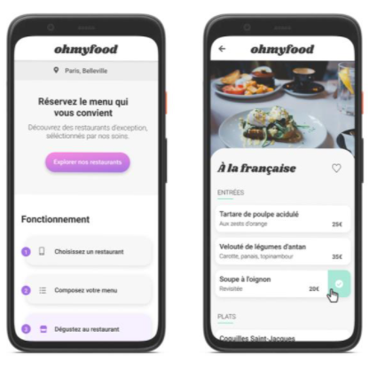

# ohmyfood

Projet n°3 "Développeur web" d'OpenClassroom.

Ohmyfood! est une entreprise de commande de repas en ligne, permettant aux utilisateurs de composer leur propre menu.
Ohmyfood! veut proposer à ces clients les menus de restaurants gastronomiques sur Paris.

## Objectifs

Intégrer et dynamiser une page web avec des animations CSS :

1. Développer un site proposant le menu de 4 grands restaurants parisiens.
2. Permettre la réservation en ligne et la composition de menus.

[brief complet ici](https://s3-eu-west-1.amazonaws.com/course.oc-static.com/projects/DW_P3/Brief%20cre%CC%81atif%20-%20Ohmyfood!.pdf)

## Livrables

### Contenu des pages

- **Page d’accueil**
  Localisation des restaurants
  Une section avec les 4 restaurants.
  Au clic sur le restaurant on est redirigé vers la page du menu.
- **Pages de menu (x4)**
  4 pages contenant chacune le menu d'un restaurant.
- **Header**
  Présent sur toutes les pages avec le logo.
  Sur les pages menu, un bouton retour vers la page d'acceuil.
- **Footer**
  Identique sur toutes les pages.
  Au clic sur "Contact", un renvoi vers une adresse mail.

### Animations

**Boutons**

- Au survol, la couleur de fond des boutons principaux devra légèrement s’éclaircir et l'ombre portée devra également être plus visible.
- À terme, les visiteurs pourront sauvegarder leurs menus préférés avec un bouton "J’aime" en forme de cœur et il devra se remplir progressivement.
  **Page d’accueil**
- Quand l’application aura plus de menus, un “loading spinner” sera nécessaire. Il devra apparaître pendant 1 à 3 secondes quand on arrive sur la page d'accueil et couvrir l'intégralité de l'écran.

**Pages de menu**

- À l’arrivée sur la page, les plats devront apparaître progressivement avec un léger décalage dans le temps et pourront apparaître soit un par un, soit par groupe.
- Le visiteur peut ajouter les plats qu'il souhaite à sa commande en cliquant dessus. Cela fait apparaître une petite coche à droite du plat. Cette coche devra coulisser dela droite vers la gauche.

## Technologies

- Le développement se fera en HTML / CSS / Sass (si possible).
- Aucun Frameworks et pas de CSS Inline / sans Javascript.

## Notes

**Polices :**

- Logo & titres: Shrikhand
- Texte: Roboto

**Couleurs :**

- Primaire: #9356DC
- Secondaire: #FF79DA
- Tertiaire: #99E2D0

**Compatibilité :**

- Approche mobile-first et seules les maquettes mobiles seront réalisées.
- Sur Tablette et Desktop, mise en page libre et devra s'adapter aux supports mais pas prioritaires.
- Validation W3C en HTML et CSS sans erreur.
- Compatibilité : Dernières versions de Chrome et Firefox.
